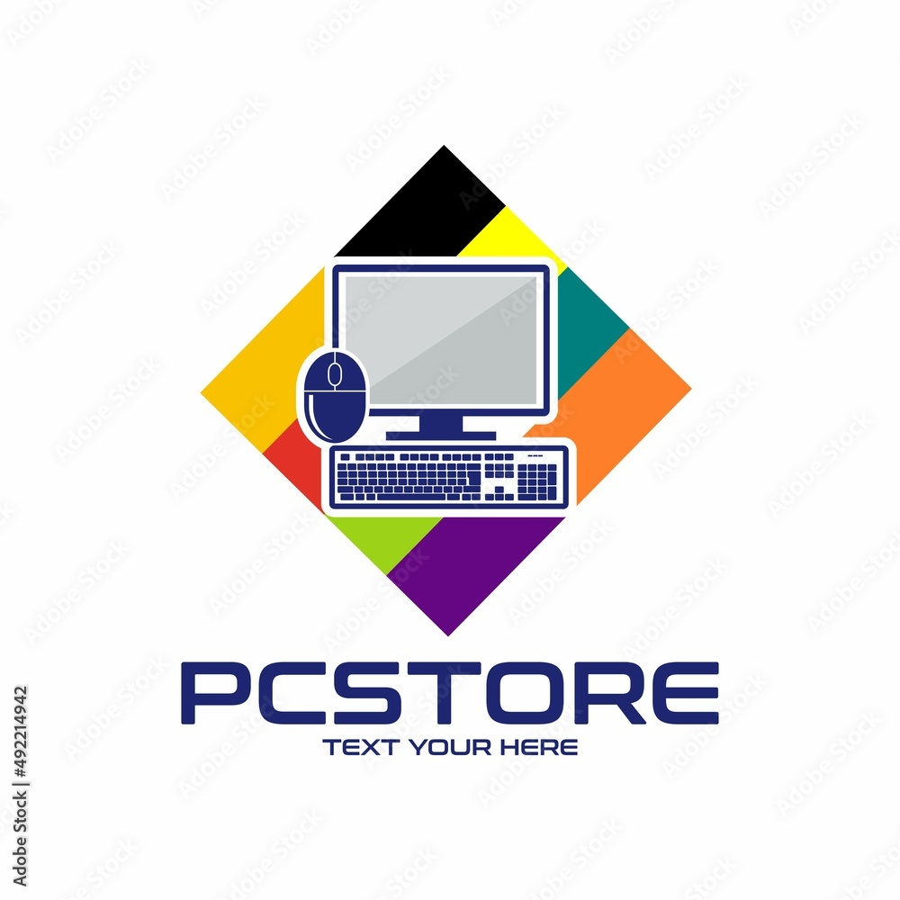
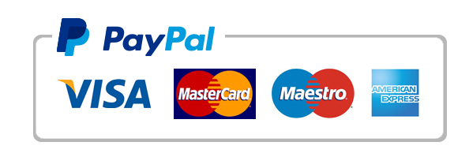

# VENTA DE PC
### PROBLEMAS 
Como vendedor de Pc , mi objetivo principal es ayudar a los clientes a encontrar la mejor solucion tecnologica que se adapte a sus necesidades: para logralo necesito:

## Entender las Necesidades del Cliente
 
- Escuchar atentamente: Haz preguntas abiertas para comprender sus requerimientos específicos, su presupuesto, y qué tipo de tareas realizarán con la PC.
- Analizar sus necesidades: ¿Es para uso personal, profesional, para juegos, para diseño gráfico, etc.?
- Identificar sus prioridades: ¿Necesitan un equipo potente, portátil, económico, con una pantalla grande, etc.?
 
## Conocer las Diferentes Soluciones
 
- Mantente actualizado: Sigue las últimas tendencias en hardware y software, conoce las marcas y modelos disponibles.
- Compara diferentes opciones: Investiga las especificaciones de cada componente, como procesadores, memoria RAM, almacenamiento, tarjetas gráficas, etc.
- Define las mejores opciones:  Recomienda diferentes configuraciones de PC que se ajusten a las necesidades y presupuesto del cliente.
 
## Comunicar las Soluciones de Forma Clara
 
- Habla el lenguaje del cliente: Explica las características técnicas en términos sencillos y fáciles de entender.
- Muestra las ventajas de cada solución:  Resalta las ventajas de cada opción, incluyendo rendimiento, eficiencia, duración de la batería, etc.
- Responde a sus dudas:  Brinda información detallada y respuestas claras a todas sus preguntas.
 
## Ofrecer un Servicio Personalizado
 
- Asesoramiento personalizado:  Recomienda las mejores soluciones y configuraciones para cada caso.
- Atención al cliente:  Brinda un servicio de atención al cliente excepcional antes, durante y después de la compra.
- Instalación y configuración:  Ayuda a instalar el software necesario y configurar la PC según las necesidades del cliente.
 
## Recuerda:
 
- La honestidad es clave:  Recomienda las soluciones más adecuadas, sin buscar solo la venta más cara.
- La confianza es fundamental:  Construye una relación de confianza con tus clientes para fidelizarlos.
- La satisfacción del cliente es tu objetivo:  Busca que los clientes se sientan satisfechos con la compra y el servicio que reciban.

## SOLUCIONES

Soluciones para la Venta de PCs: Un Enfoque Híbrido
 
Para impulsar las ventas de PCs en el mercado actual, se necesita una estrategia que combine lo mejor del mundo digital con la atención personalizada.
 
## Atraer Clientes con una Presencia Online Fuerte:
 
- Sitio web profesional: Un sitio web moderno y fácil de navegar con información detallada sobre productos, configuraciones, precios y servicios. [1] [2]
- Marketing digital estratégico:  Utilizar SEO, SEM, redes sociales y email marketing para llegar a tu público objetivo. [3]
- Contenido de valor:  Crear contenido útil y atractivo (guías, tutoriales, comparativas) que posicione a tu negocio como experto.
- Promociones y ofertas atractivas:  Descuentos, combos, financiación y programas de fidelización para incentivar la compra. [4]
 
## Ofrecer una Experiencia de Compra Personalizada:
 
- Asesoramiento experto:  Un equipo de ventas capacitado para entender las necesidades del cliente y ofrecer soluciones a medida. [5]
- Configurador de PCs online:  Permitir a los clientes personalizar su PC online con diferentes componentes y opciones.
- Servicio de armado de PCs:  Ofrecer la posibilidad de armar PCs a medida según las especificaciones del cliente.
- Instalación y configuración:  Brindar servicios de instalación y configuración de la PC y el software.
 
## Construir una Relación de Confianza:
 
- Atención al cliente excepcional:  Respuesta rápida, soluciones eficientes y seguimiento post-venta.
- Garantía y soporte técnico:  Ofrecer garantía de fábrica y soporte técnico confiable para resolver cualquier problema.
- Feedback y mejora continua:  Solicitar feedback a los clientes para mejorar productos, servicios y procesos.
 
## Innovación y Adaptación al Mercado:
 
- Soluciones para diferentes nichos:  Ofrecer PCs especializadas para gamers, profesionales, empresas, etc.
- Integración de servicios:  Combinar la venta de PCs con servicios de mantenimiento, reparación, actualización de software, etc.
- Tendencias tecnológicas:  Mantenerse actualizado con las últimas tendencias en hardware y software para ofrecer soluciones innovadoras.
 
## MVP 
### NOMBRE DE LA APLICACION 
"PC-STORE"

Para un MVP de venta de PCs, el sistema de pago más adecuado debe ser simple, seguro y ampliamente aceptado.  El objetivo es facilitar el proceso de compra y minimizar las fricciones para el usuario.
 
Considerando estos factores, las mejores opciones serían:
 
## Pasarelas de Pago Online:
 
- Stripe:  Es una de las pasarelas de pago más populares, conocida por su facilidad de integración y seguridad.  Acepta tarjetas de crédito y débito, así como PayPal. [1]
- PayPal:  Es un sistema de pago muy reconocido y ampliamente utilizado, especialmente para compras online.  Ofrece seguridad y protección al comprador. [2]
- Mercado Pago:  Es una opción popular en Latinoamérica, con un sistema de pago seguro y opciones de financiación. [3]
 
Ventajas:
 
- Facilidad de Integración:  Se integran fácilmente con plataformas de comercio electrónico y sitios web.
- Seguridad:  Ofrecen medidas de seguridad robustas para proteger las transacciones.
- Amplia Aceptación:  Son ampliamente aceptados por los usuarios, lo que facilita la compra.
- Opciones de Pago:  Ofrecen diferentes métodos de pago, incluyendo tarjetas de crédito, débito y transferencias bancarias.

 
## Integración con Plataformas de Comercio Electrónico:
 
- Shopify Payments:  Si utilizas Shopify como plataforma de comercio electrónico, puedes integrar su sistema de pago de forma nativa. [4]
- WooCommerce Payments:  Similar a Shopify, WooCommerce ofrece su propio sistema de pago para tiendas online. [5]
 
- Simplicidad:  Se integran directamente con la plataforma de comercio electrónico, simplificando el proceso de configuración.
- Gestión Centralizada:  Permiten gestionar las transacciones y los pagos desde la misma plataforma.
 
 
 
## Recomendaciones:
 
- Evita métodos complejos:  En un MVP, es importante evitar métodos de pago complejos o poco conocidos.
- Prioriza la seguridad:  Elige una pasarela de pago con medidas de seguridad robustas para proteger la información del usuario.
- Ofrece opciones de pago:  Proporciona diferentes opciones de pago para adaptarse a las preferencias del usuario.

Recuerda:  El sistema de pago que elijas debe ser compatible con la plataforma de comercio electrónico que utilizas para tu MVP.
 
Al elegir un sistema de pago simple, seguro y ampliamente aceptado, podrás facilitar el proceso de compra y aumentar las posibilidades de éxito de tu MVP.

https://trello.com/b/fm3ivKCP/nombre-de-la-app

